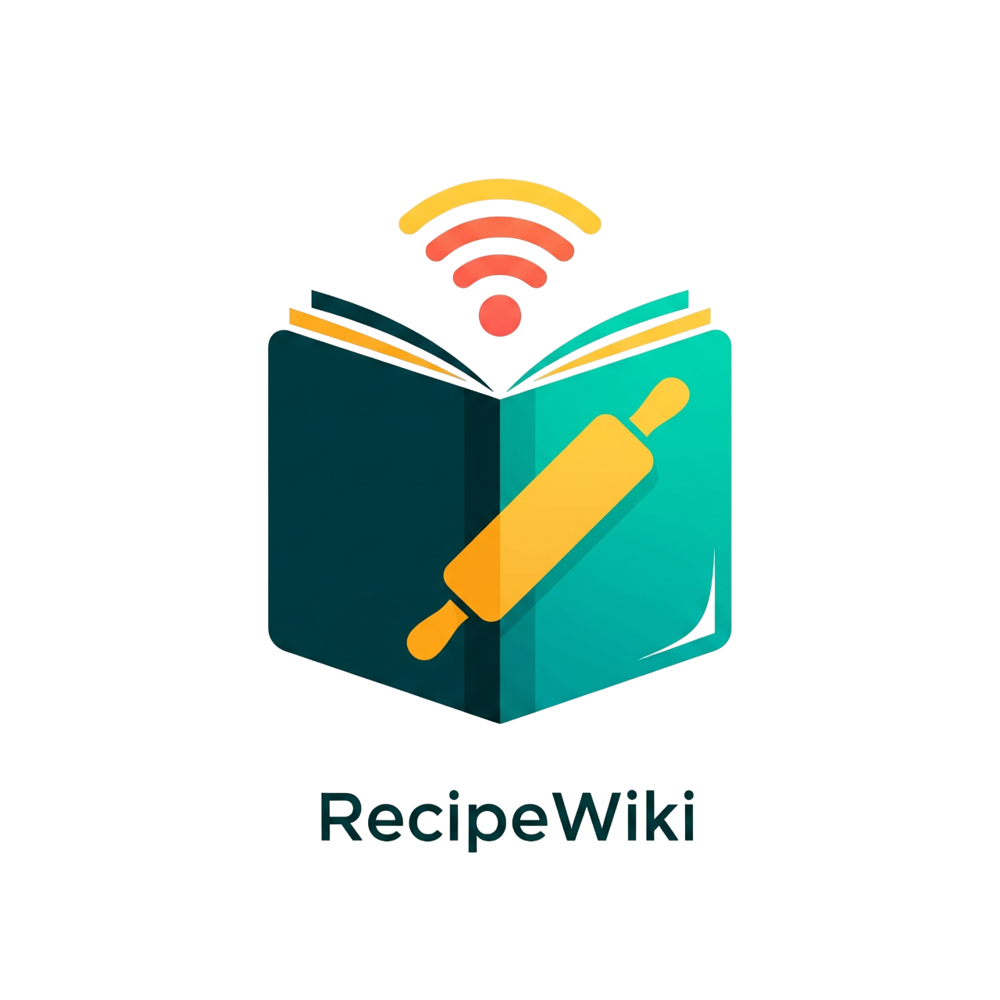
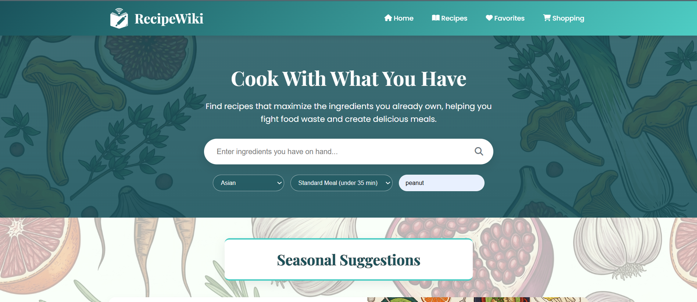

<table>
  <tr>
    <td><h1>RecipeWiki - Your Smart & Sustainable Cooking Assistant!</h1></td>
    <td align="right">
      
    </td>
  </tr>
</table>



## Brief description of the project

RecipeWiki is a web application designed to foster sustainable living by helping users create meals with the ingredients they already have, thus reducing food waste. Based on our project proposal, the application provides users with recipe suggestions based on their available ingredients, filters for allergies and dietary needs, and generates a shopping list for any missing items, complete with localized pricing.

Key features include a seasonal food suggestion system to promote local produce and, to make learning about sustainability more engaging, the "Food Waste Sorting Challenge." This is an interactive drag-and-drop game where users test their knowledge by sorting food scraps into the correct bins.

## Team members

  * Natasha Kanth
  * Lois Sturkenboom
  * Khaled Altahan
  * Sam-Arjuna Friedzoon Manders

## Installation details

### Prerequisites:

  - Python 3.10+ and `pip`
  - A virtual environment is recommended.

### Setup:

1.  **Clone the repository:**

    ```bash
    git clone <your-repository-url>
    cd <your-repository-name>
    ```

2.  **Set up the virtual environment:**

    ```bash
    # Create a virtual environment
    python -m venv .venv
    # Activate it (Windows)
    .\.venv\Scripts\activate
    ```

3.  **Install dependencies:**
    Navigate to the `backend` folder and install the required packages.

    ```bash
    cd backend
    pip install -r requirements.txt
    ```

4.  **Create the Environment File:**
    In the `backend` directory, open a file named `.env` and add your Spoonacular API key:

    ```
    SPOONACULAR_API_KEY="YOUR_API_KEY_HERE"
    ```

### Starting the server:

Once the setup is complete, run the Flask application from the `backend` directory:

```bash
python app.py
```

The server will start, typically on `http://127.0.0.1:5000`.

## Running the Tests

The backend has a comprehensive test suite built with `pytest`. To run the tests, navigate to the `backend` directory and run:

```bash
pytest
```

## Project Structure

```
AP-Group9-PROJECT/                  # Root directory of the project
├── backend/                         # Backend source code
│   ├── __pycache__/                 # Python cache files
│   ├── recipe_wiki/                 # Main backend app package
│   │   ├── __pycache__/             # Cache for the package
│   │   ├── __init__.py              # Marks as a Python package
│   │   └── wiki.py                  # RecipeWiki and Recipe class
│   └── tests/                       # Backend test suite
│   │   ├── __pycache__/             # Cache for tests
│   │   ├── .pytest_cache/           # Test run cache
│   │   ├── context.py               # Test setup and fixtures
│   │   ├── test_crud                #Test for favorites CRUD
│   │   ├── test_shoppinglist.py     #Test for creating and sharing shopping list             
│   │   └── test_filter.py           # Tests for the search filter
│   ├── .env                         # Environment variables to store the API key
│   ├── .gitignore                   # Specifies files to ignore in Git
│   ├── app.py                       # Back-end Flask server
│   ├── favorite_recipes.json        # Favorite recipes
│   ├── seasonal_food.json           # seasonla ingredients database
│   ├── supermarkets_by_country.json # local supermarkets database
│   └── requirements.txt             # Python package dependencies
│
│
├── frontend/                        # Main frontend application
│   ├── static/                      # Static assets (CSS, JS, images)
│   │   ├── hero-background.png      # Hero image
│   │   ├── logo.png                 # Logo image
│   │   ├── new-seasonal-image.png   # Seasonal food section image             
│   │   ├── scripts.js               # Frontend JavaScript
│   │   ├── shared-background.png    # Main bacground image
│   │   ├── shopping-background.png  # Soppinglist section image
│   │   └── styles.css               # Stylesheet   
│   │       
│   └── templates/
│       ├── index.html               # HTML template for the web page
│       └── shopping_list.html       # HTML template for the shared shoppinglist page
├── LICENSE                          # Project license information
├── requirements.md                  # App requirements
├── README.md                        # Project overview and instructions
└── app-screenshot.png               # Website design demo
```